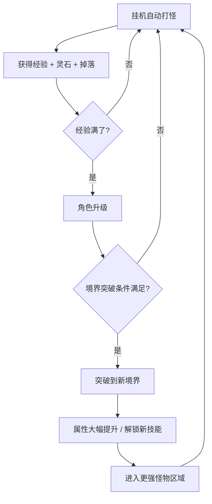

# 修仙挂机小游戏 — 设计文档

## 1. 游戏概述

| 项目 | 说明 |
|------|------|
| 类型 | 微信小游戏 / 2D 像素风 / 修仙挂机（Idle RPG） |
| 玩法 | 修仙者自动战斗打怪，离线也有收益，持续变强 |
| 美术 | 像素风（Pixel Art），固定场景战斗 |
| 开发策略 | 先轻后重：先跑通核心战斗+境界突破，再逐步扩展 |

---

## 2. 核心循环



### 核心资源

| 资源 | 获取方式 | 用途 |
|------|----------|------|
| 修为（EXP） | 打怪自动获得 | 升级、突破境界 |
| 灵石 | 打怪掉落 | 购买物品、强化装备 |
| 装备 | 打怪掉落 | 穿戴提升属性 |
| 功法残卷 | 打怪低概率掉落 | 合成完整功法 |

---

## 3. 场景架构

### 3.1 场景列表

| 场景 | 用途 |
|------|------|
| 战斗主场景 | 固定战斗画面，角色+怪物+伤害数字+掉落物 |
| 修炼面板 | 弹出层，显示境界信息、突破按钮 |
| 背包面板 | 弹出层，查看/穿戴/出售装备 |
| 设置面板 | 弹出层 |

### 3.2 战斗主场景 UI 布局（竖屏）

```
┌──────────────────────────┐
│  灵石: 12345  修为: 67%   │  ← 顶部资源栏
├──────────────────────────┤
│                          │
│        [背景：修炼场景]     │  ← 像素风背景（山林/洞府）
│                          │
│      🐉 [怪物]           │  ← 怪物在固定位置生成
│          ↓ -99           │  ← 伤害数字浮动
│        ⚔️               │  ← 攻击特效
│       👤 [修仙者]         │  ← 玩家角色
│                          │
│   ┌──┐  ┌──┐  ┌──┐      │
│   │修│  │背│  │装│      │  ← 底部功能按钮
│   │炼│  │包│  │备│      │
│   └──┘  └──┘  └──┘      │
└──────────────────────────┘
```

---

## 4. 实体设计

### 4.1 修仙者（Player / Cultivator）

```js
class Cultivator {
  // 基本信息
  name: string;          // 道号
  level: number;         // 当前等级（1~∞）
  realm: string;         // 当前境界（炼气→筑基→金丹→元婴→化神→...）
  
  // 战斗属性
  hp: number;            // 当前生命
  maxHp: number;         // 最大生命
  attack: number;        // 攻击力
  defense: number;       // 防御力
  attackSpeed: number;   // 攻击间隔（秒）
  critRate: number;      // 暴击率
  critDamage: number;    // 暴击伤害倍率
  
  // 修炼属性
  exp: number;           // 当前修为
  maxExp: number;        // 升级所需修为
  spirit: number;        // 灵力（用于释放技能）
  maxSpirit: number;
  
  // 装备
  equipment: {
    weapon: Equipment|null;   // 武器
    armor: Equipment|null;    // 防具
    accessory: Equipment|null;// 饰品
    // ...
  };
  
  // 技能
  skills: Skill[];       // 已学会的技能列表
  
  // 表现
  x: number;             // 屏幕坐标X（固定位置，底部偏左）
  y: number;
  sprite: Image;         // 像素风角色精灵
  state: 'idle'|'attack'|'hurt'|'breakthrough'; // 动画状态
}
```

### 4.2 怪物（Monster）

```js
class Monster {
  // 属性
  name: string;          // 名称（妖兽/小妖/魔修...）
  level: number;
  hp: number;
  maxHp: number;
  attack: number;
  defense: number;
  
  // 掉落
  expReward: number;     // 击杀修为奖励
  stoneReward: number;   // 击杀灵石奖励
  dropTable: DropItem[]; // 掉落表
  
  // 表现
  x: number;             // 固定位置（屏幕中上部）
  y: number;
  sprite: Image;
  state: 'idle'|'attack'|'hurt'|'dead';
  
  // 行为
  respawnCooldown: number; // 死亡后重生等待时间
}
```

### 4.3 伤害数字（DamageNumber）

```js
class DamageNumber {
  value: number;       // 伤害数值
  x: number;
  y: number;
  alpha: number;       // 透明度（渐隐）
  vy: number;          // 向上浮动速度
  color: string;       // 颜色（普通白/暴击黄/技能蓝/治疗绿）
  isCrit: boolean;     // 是否暴击
}
```

### 4.4 掉落物（DropItem）

```js
class DropItem {
  item: Item;          // 掉落物品数据
  x: number;
  y: number;
  collected: boolean;  // 是否已被拾取
  flyToTarget: boolean;// 是否正在飞向玩家
}
```

---

## 5. 系统设计

### 5.1 战斗系统

```
战斗流程（全自动）：
  1. 怪物从对象池生成，显示在固定位置
  2. 修炼者按攻击间隔自动攻击目标怪物
  3. 伤害计算：
     基础伤害 = 攻击力 - 目标防御力（最低为1）
     暴击时：伤害 = 基础伤害 * 暴击倍率
     技能加成：伤害 = 伤害 * 技能倍率
  4. 伤害数字浮动显示
  5. 怪物死亡 → 发放修为、灵石 → 检查掉落 → 重生计时 → 新怪物
```

**关键点**：
- 修炼者不会死亡（挂机游戏），血量仅作为"被击退"参考或直接删除死亡逻辑
- 怪物按波次或按地区自动生成，由玩家当前境界决定怪物等级
- 离线时按时间计算模拟战斗收益

### 5.2 修炼系统

#### 境界体系（中国修仙经典设定）

```
境界序列：
  1. 炼气期（Lv 1-10）
  2. 筑基期（Lv 11-25）
  3. 金丹期（Lv 26-45）
  4. 元婴期（Lv 46-70）
  5. 化神期（Lv 71-100）
  6. 炼虚期（Lv 101-135）
  7. 合体期（Lv 136-175）
  8. 大乘期（Lv 176-220）
  9. 渡劫期（Lv 221-270）
  10. 真仙境（Lv 271+）
```

**突破条件**：
- 达到当前境界满级
- 消耗一定数量的灵石
- （后期版本）需要特定丹药或渡劫成功率

**突破效果**：
- 属性大幅提升（攻击+50%、生命+100% 等）
- 解锁新技能
- 改变玩家外观（不同境界不同像素精灵）
- 刷新怪物区域

### 5.3 装备系统（Phase 2）

```
装备部位：
  - 武器：提升攻击力
  - 头盔：提升防御、生命
  - 衣服：提升防御、生命
  - 鞋子：提升攻击速度
  - 饰品（戒指/项链）：特殊效果（暴击率、经验加成等）

装备品质：
  ┌──────┬──────┬─────────────┐
  │ 品质  │ 颜色  │ 属性倍率     │
  ├──────┼──────┼─────────────┤
  │ 凡品  │ 白   │ 1.0x        │
  │ 良品  │ 绿   │ 1.3x        │
  │ 上品  │ 蓝   │ 1.7x        │
  │ 极品  │ 紫   │ 2.2x        │
  │ 仙品  │ 橙   │ 3.0x        │
  │ 神器  │ 红   │ 5.0x + 词缀 │
  └──────┴──────┴─────────────┘
```

### 5.4 离线收益系统

```
离线收益 = 在线挂机收益 * 离线时长 * 离线系数

离线系数规则：
  - 离线 ≤ 2小时：收益 100%
  - 离线 2-8小时：收益 80%
  - 离线 8-24小时：收益 50%
  - 离线 > 24小时：封顶 24 小时的 50%

离线收益包含：修为、灵石
离线收益不包含：装备掉落（或简化为一键"离线结算抽奖"）
```

**实现**：进入游戏时读取上次离开时间戳，计算差值并一次性结算。

### 5.5 技能/功法系统（Phase 3）

```
技能类型：
  - 主动攻击技能（有 CD，自动释放）
    - 飞剑术：造成 200% 攻击伤害
    - 雷霆咒：造成 150% 攻击的雷电伤害
  - 被动技能（永久生效）
    - 炼体诀：生命上限 +20%
    - 剑心通明：暴击率 +10%
  - 光环技能（范围效果）
    - 聚灵阵：修为获取速度 +15%

技能来源：功法残卷合成 / 境界突破解锁 / 商店购买
```

---

## 6. 数值体系

### 6.1 等级成长公式（参考）

```
等级 N 所需经验：
  expRequired(N) = floor(100 * 1.15^(N-1))

等级 N 的攻击力：
  attack(N) = floor(10 * 1.12^(N-1))

等级 N 的生命值：
  hp(N) = floor(100 * 1.1^(N-1))
```

### 6.2 怪物数值（与玩家等级匹配）

```
怪物等级 = 玩家等级 ± 2（在该境界范围内随机）
怪物属性 = 同等级玩家属性的 40%~60%（1v1 约 5-10 秒击杀）
怪物修为奖励 = expRequired(玩家等级) / 击杀所需次数
击杀所需次数 ≈ 15~25 次 / 级（确保升级节奏）
```

---

## 7. 数据存储

```js
// 使用 wx.setStorageSync / getStorageSync 本地存储
const saveData = {
  // 玩家属性
  level: 1,
  realm: '炼气期',
  exp: 0,
  spiritStone: 0,
  
  // 装备
  equipment: {
    weapon: null,    // 或装备对象
    armor: null,
    // ...
  },
  
  // 技能
  skills: [],
  
  // 离线记录
  lastOnlineTime: 1699999999999,  // 上次在线时间戳
  
  // 统计数据
  totalKills: 0,
  totalPlayTime: 0,
};
```

---

## 8. 技术架构（基于现有项目改造）

### 8.1 目录结构规划

```
/
├── game.js                    # 入口（保持不变）
├── game.json                  # 配置
├── project.config.json
├── docs/
│   └── design.md              # 本设计文档
├── images/                    # 像素风美术资源
│   ├── cultivator/            # 修炼者各境界精灵
│   ├── monsters/              # 怪物精灵
│   ├── ui/                    # UI元素
│   └── effects/               # 特效帧动画
├── js/
│   ├── main.js                # 游戏主循环（改造）
│   ├── databus.js             # 全局状态管理（扩展）
│   ├── render.js              # Canvas 初始化（保持不变）
│   ├── base/
│   │   ├── sprite.js          # 基础精灵类（复用）
│   │   ├── animation.js       # 帧动画（复用）
│   │   └── pool.js            # 对象池（复用）
│   ├── entities/
│   │   ├── cultivator.js      # 修仙者实体
│   │   ├── monster.js         # 怪物实体
│   │   ├── damageNumber.js    # 伤害数字实体
│   │   └── dropItem.js        # 掉落物实体
│   ├── systems/
│   │   ├── combat.js          # 战斗系统
│   │   ├── cultivation.js     # 修炼系统
│   │   ├── equipment.js       # 装备系统
│   │   ├── skill.js           # 技能系统
│   │   └── offline.js         # 离线收益系统
│   ├── ui/
│   │   ├── topBar.js          # 顶部资源栏
│   │   ├── bottomBar.js       # 底部功能按钮
│   │   ├── panelCultivation.js # 修炼面板
│   │   ├── panelBag.js        # 背包面板
│   │   └── floatingText.js    # 浮动文字
│   ├── config/
│   │   ├── realms.js          # 境界配置表
│   │   ├── monsters.js        # 怪物配置表
│   │   ├── skills.js          # 技能配置表
│   │   └── equipment.js       # 装备配置表
│   └── utils/
│       ├── storage.js         # 存储工具
│       └── number.js          # 数值计算工具
└── audio/                     # 音频资源
```

### 8.2 游戏主循环改造

基于现有 `js/main.js`，改造为：

```js
class Main {
  bg = new Background();
  cultivator = new Cultivator();
  combat = new CombatSystem();
  ui = new UIManager();
  
  update() {
    // 1. 更新修炼者状态
    this.cultivator.update();
    
    // 2. 战斗系统驱动
    this.combat.update();
    
    // 3. UI更新
    this.ui.update();
    
    // 4. 自动存档（每N帧）
    if (databus.frame % 600 === 0) {
      saveToStorage();
    }
  }
  
  render(ctx) {
    ctx.clearRect(0, 0, canvas.width, canvas.height);
    this.bg.render(ctx);
    this.cultivator.render(ctx);
    this.combat.render(ctx);   // 怪物+伤害数字+掉落物
    this.ui.render(ctx);
  }
}
```

### 8.3 可复用的现有基础模块

| 现有模块 | 复用方式 |
|----------|----------|
| `js/base/sprite.js` | 直接复用，作为所有实体基类 |
| `js/base/animation.js` | 复用，用于攻击特效、突破特效 |
| `js/base/pool.js` | 复用，管理怪物、伤害数字、掉落物 |
| `js/render.js` | 直接复用，Canvas 初始化 |
| `js/libs/tinyemitter.js` | 复用，事件通信 |
| `js/runtime/background.js` | 改造为静态/视差背景 |

---

## 9. 开发阶段规划

### Phase 1 — 核心战斗 MVP（目标：可玩）

- [ ] 创建 `Cultivator` 实体（静态精灵 + 自动攻击动画）
- [ ] 创建 `Monster` 实体（生成、受击反馈、死亡）
- [ ] 创建 `DamageNumber` 浮动伤害数字
- [ ] 实现自动攻击战斗循环
- [ ] 顶部资源栏显示（修为条、灵石数）
- [ ] 底部三个功能按钮（修炼/背包/装备 — 先空壳）
- [ ] 像素风占位素材

### Phase 2 — 修炼 & 离线收益

- [ ] 境界系统（炼气→筑基→金丹，含突破条件与属性加成）
- [ ] 离线收益计算与结算界面
- [ ] 修炼面板 UI
- [ ] 数据本地存档/读档
- [ ] 不同境界的怪物区域切换

### Phase 3 — 装备系统

- [ ] 装备掉落、品质随机
- [ ] 背包面板（列表查看、穿戴、出售）
- [ ] 装备属性加成计算

### Phase 4 — 丰富内容

- [ ] 技能/功法系统
- [ ] 音效与背景音乐
- [ ] 排行榜（开放数据域）
- [ ] 更完整的怪物种类与区域
- [ ] 修炼洞府、宗门系统（可选）

---

## 10. 参考素材

### 像素风修仙素材方向
- 角色：24×24 或 32×32 的小人，中式古装造型
- 怪物：妖兽（狼妖、蛇妖）、邪修、傀儡
- 场景：山林、洞府、宗门大殿
- UI：仿古书/竹简风格的边框和按钮

推荐像素画工具：Aseprite / Piskel（免费Web版）

---

## 变更记录

| 日期 | 版本 | 变更内容 |
|------|------|----------|
| 2026-05-15 | v0.1 | 初始版本，梳理核心设计思路 |
